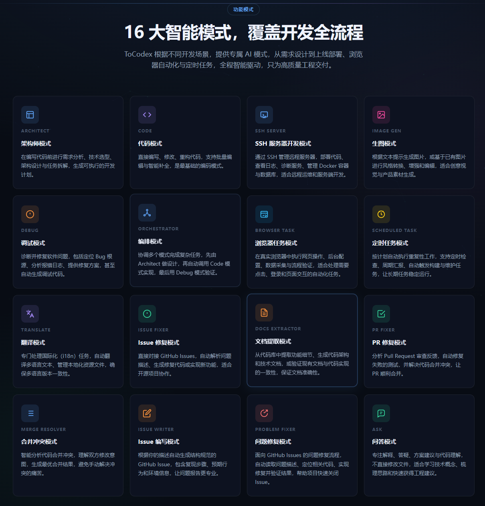
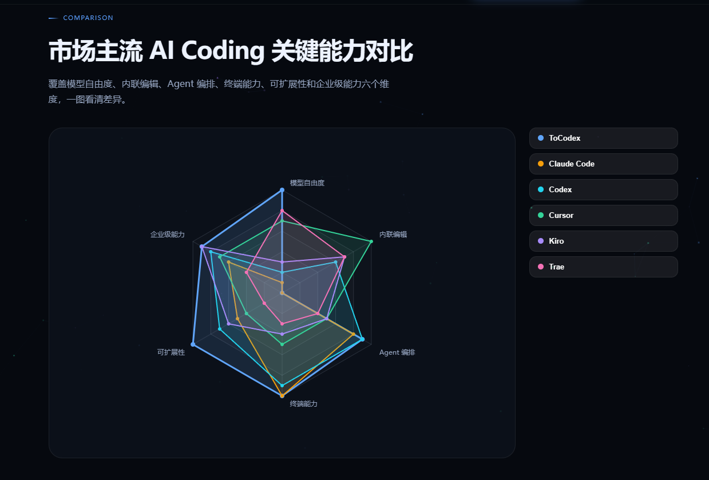
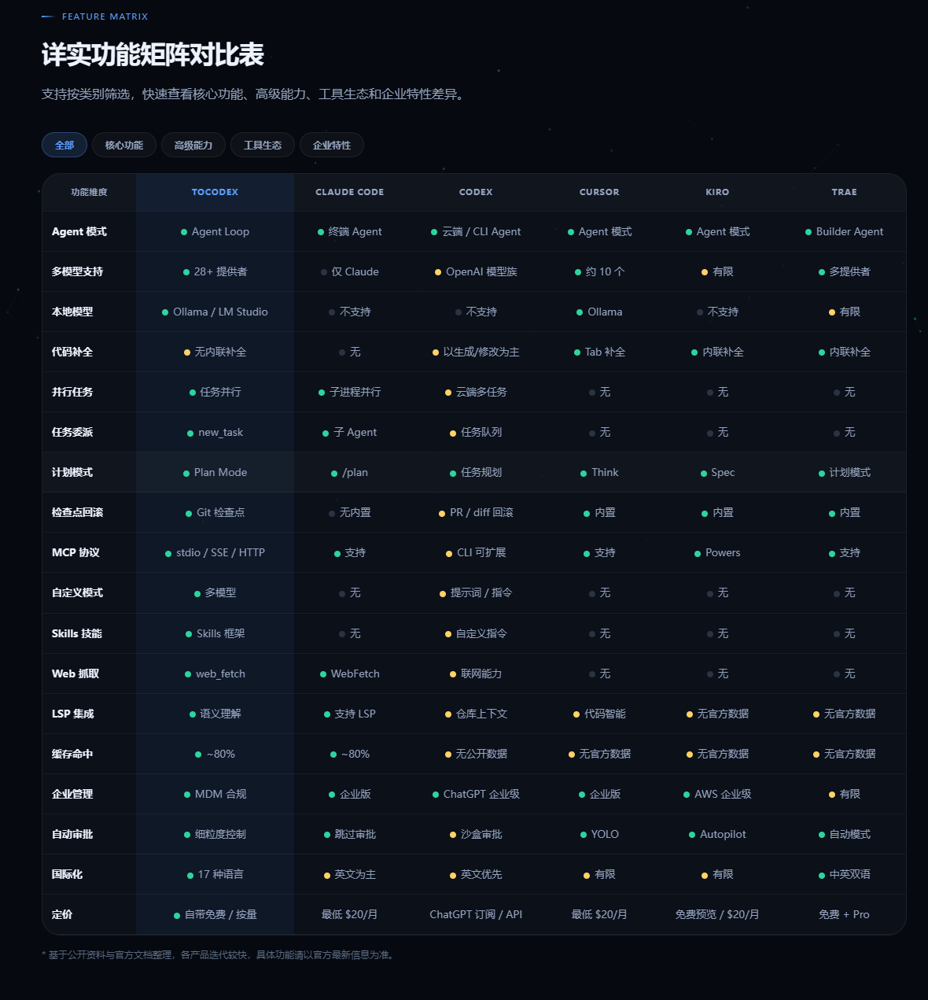
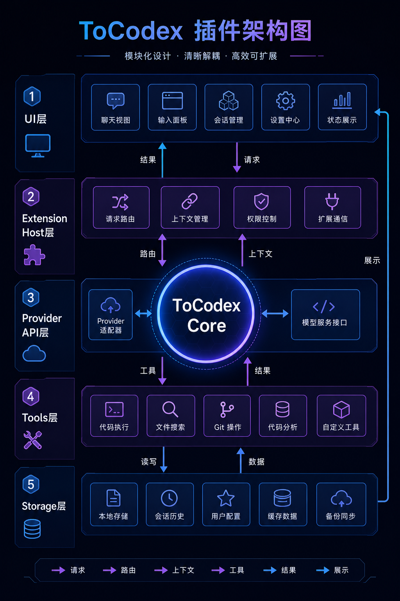
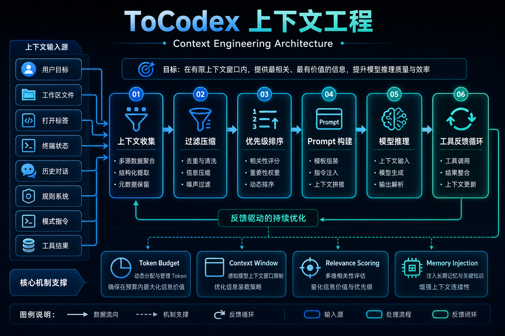
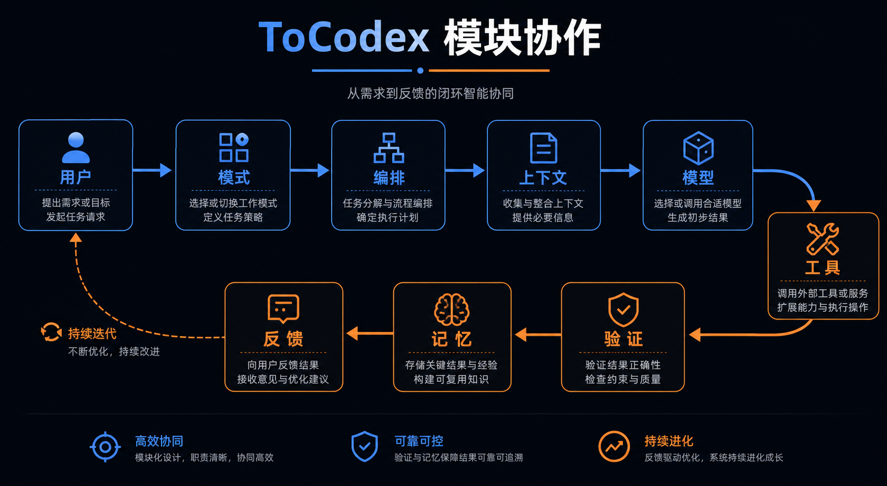
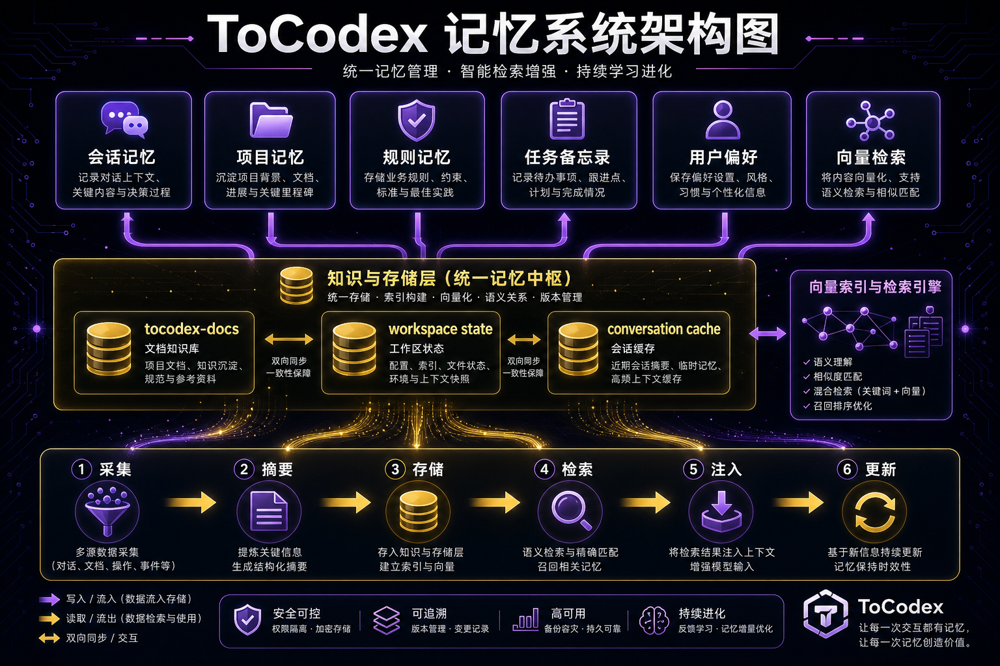

# ToCodex Community

ToCodex Community is a maintained open-source AI coding agent for VS Code, evolved from Roo Code and kept independent for community use. It focuses on practical engineering workflows: planning, editing, debugging, terminal work, MCP tools, multi-model providers, and repeatable project automation inside the editor.

Website: https://tocodex.com
Source: https://github.com/tocodex-ai/tocodex-community

ToCodex Community is based on Roo Code and preserves Apache-2.0 upstream attribution. ToCodex is not affiliated with Roo Code, Inc. Roo Code is a trademark of its respective owner.

## Highlights

- Maintained VS Code extension for AI-assisted software development.
- BYOK, local models, OpenAI-compatible providers, and configurable model routing.
- MCP integration for external tools, services, and project-specific workflows.
- Custom modes, slash commands, skills, hooks, and scheduled tasks.
- Context-aware file search, code editing, terminal interaction, worktree support, and task history.
- Community-oriented source distribution with telemetry disabled and cloud implementation stubbed.
- Optional ToCodex Desktop, Cloud, and Enterprise offerings remain separate commercial products.

## What ToCodex Adds Beyond Roo Code

ToCodex Community is maintained as an independent continuation based on Roo Code, with upstream attribution preserved. In this comparison, v1 means the Roo Code-derived baseline and v2/v3 means the ToCodex functional upgrade layer added on top of it.

### Featured Upgrades

| Feature | Why It Matters |
| --- | --- |
| **Plan Mode and persisted planning** | Lets the agent explore in read-only mode, present a structured plan, persist task progress, and move into implementation only after confirmation. |
| **Browser Task mode** | Adds a new browser-oriented workflow for page interaction, inspection, login-state handling, Playwright MCP usage, and web UI operation. |
| **Parallel multi-agent work** | Adds `spawn_parallel_task` so independent subtasks can run concurrently, with status tracking and support for up to 10 parallel tasks at the same time. |
| **Main model plus auxiliary model** | Separates the primary coding model from a lighter auxiliary model for summaries, condense, memory, and background support work. |
| **Built-in `web_fetch`** | Fetches URLs directly, converts pages to Markdown, handles trusted documentation domains, and reduces dependence on external MCP just to read web content. |

### Major New Modes And Capabilities

| Status | Major Capability | What It Adds |
| --- | --- | --- |
| **ENHANCED** | Complex large-project refactoring | Improves large-repository refactoring with multi-solution comparison, dependency tracing, staged implementation, proactive verification, and clearer risk control. |
| **NEW** | SSH Server mode | Adds remote server administration workflows, including SSH execution, Docker container operations/logs, PostgreSQL queries, deployment checks, and infrastructure diagnostics. |
| **NEW** | Image Gen mode | Adds a dedicated image generation workflow for text-to-image, image-to-image, targeted image editing, saved image handling, and ToCodex image model routing. |
| **NEW** | Browser Task mode | Adds browser task automation for page interaction, inspection, login-state handling, Playwright MCP usage, Chrome/Edge reuse, and web UI workflows. |
| **NEW** | Scheduled Task mode | Adds timed and repeatable background automation so tasks can run on schedule without interrupting the active foreground conversation. |
| **ENHANCED** | Memo and memory persistence | Adds persistent project notes, memory injection, `/remember`, `/forget`, background memory extraction, and task progress persistence for long-running work. |

| Dimension | Roo Code v1 Baseline | ToCodex v2/v3 Upgrade |
| --- | --- | --- |
| Code understanding | Relies mostly on `grep` / `search_files` style text search. | Adds `lsp_code_intelligence` backed by VS Code language services: go to definition, find references, hover/type information, symbols, and call hierarchy. |
| Session continuity | Each task largely starts from fresh conversational context. | Adds project memory loading/injection, `/remember`, `/forget`, background memory extraction, memory compression, and persisted project notes. |
| Task awareness | Limited progress visibility during long-running agent work. | Adds real-time progress summaries, richer task headers, cost display, context window UI, and context health analysis. |
| Loop detection | Detects repeated tool use mainly through exact string matching. | Adds semantic repetition detection for repeated file reads, diffs, and commands even when parameters vary slightly. |
| Error handling | Tool failure often interrupts the task and asks for user intervention. | Adds retry/fallback execution strategy, clearer retry summaries, and tool degradation paths such as diff fallback handling. |
| Cost control | Provides basic token usage visibility. | Adds per-task `CostTracker`, per-model cost breakdown, budget warnings/stops, cache-hit visibility, and auxiliary/light model routing for background work. |
| Task persistence | Todo state is mostly useful inside the active session. | Adds persisted todo progress, task progress storage, `/resume` recovery, and stronger task state handling for multi-step work. |
| Planning ability | Uses modes and prompts, but lacks an explicit in-task read-only planning gate. | Adds Plan Mode with read-only exploration, structured plan approval, visible plan state, and controlled transition from planning to execution. |
| Context management | Shows context usage percentage and supports condense/truncation basics. | Adds context health analysis, token breakdowns, large-output warnings, optimization suggestions, configurable 90% auto-condense trigger, natural-language token budgets, and token-based hard truncation fallback. |
| File reading | Reads from disk repeatedly during a task. | Adds LRU file read caching with write invalidation and cache cleanup at task end. |
| Large output handling | Large file/search/command results can be inserted into context directly. | Adds automatic summarization for oversized `read_file`, `search_files`, and command outputs while preserving useful head/tail content. |
| Web content fetching | Usually needs MCP or manual pasted content. | Adds built-in `web_fetch` for URL fetching, Markdown conversion, trusted-domain handling, and long-content extraction. |
| Parallel capability | Supports single-layer parent/child task delegation. | Adds `spawn_parallel_task`, up to 10 simultaneous parallel tasks, parallel child tracking, result aggregation, and UI visibility for independent subtasks, delivering a leading efficiency gain in comparison testing. |
| Notebook editing | Does not provide a dedicated notebook cell edit tool. | Adds `notebook_edit` for cell-level replace/insert/delete operations while preserving notebook structure and outputs. |
| Automation hooks | No task-level user hook system. | Adds Agent Hooks for `PreToolUse`, `PostToolUse`, and `Stop`, including shell commands, tool filters, timeout handling, settings UI, and failure context injection. |
| Tool loading | Loads the available tool surface eagerly into the prompt. | Adds deferred tool loading and `tool_search`, enabling search/select loading when the tool count becomes large. |
| Model routing | Uses a single active model profile for most work. | Adds main/auxiliary model separation, dynamic routing for background work, provider prioritization, and user-controlled reasoning effort for dynamic models. |
| Token control | No natural-language budget instruction. | Adds token budget parsing from prompts such as `+500k`, `+2M`, or `use 1M tokens`, with UI awareness and budget checks. |
| Functional modes | Covers core engineering modes and custom mode behavior. | Expands task-specific modes across SSH Server, Image Gen, Browser Task, Scheduled Task, Issue/PR/Merge workflows, Docs Extractor, Translate, and custom workflows with separate rules and tool access. |
| Browser workflow | Browser work depends on external setup or indirect tooling. | Adds browser-oriented task execution around Playwright MCP, page interaction, login-state handling, persistent browser profiles, Chrome/Edge reuse, CDP takeover planning, and proxy/mirror fallback. |
| Scheduled automation | Tasks are primarily user-initiated one-off sessions. | Adds scheduled tasks and background-task handling so timed automation does not interrupt the active foreground conversation. |
| Image and multimodal workflows | Multimodal support is limited compared with ToCodex's later workflow surface. | Adds Image Gen mode, text-to-image, image-to-image, targeted image editing, saved image handling, multimodal image input, and ToCodex image model alignment with server routes. |
| Remote/server operations | Remote work depends on generic shell/MCP flows. | Adds SSH Server mode and direct workflows for server diagnostics, Docker container commands/logs, PostgreSQL queries, deployment checks, and infrastructure operations. |
| Safety and recovery | Provides auto-approval and checkpoint-style protections. | Strengthens fine-grained auto-approval, run-all-command controls, command allow/deny lists, protected file checks, RooIgnore-style exclusions, checkpoints, restore/diff workflows, Git worktree support, and rollback-oriented recovery. |

## Global AI Coding Tool Comparison

The AI coding market is moving quickly, and each product makes different trade-offs between model freedom, in-editor editing, agent loops, terminal capability, extensibility, and enterprise controls. The comparison below uses the visual comparison assets prepared for ToCodex Community; details may change as each vendor updates its product.

### Functional Modes



### Key Capability Radar



### Feature Matrix



In short, ToCodex Community is positioned as an open, extensible VS Code agent runtime for developers who want model choice, local-provider support, MCP tooling, custom modes, and transparent source code. Commercial ToCodex offerings can add hosted routing, account services, team controls, and enterprise support without making the community edition depend on closed-source services.

## Architecture

### Extension Code Architecture



The VS Code extension host coordinates task lifecycle, provider configuration, command registration, webview state, MCP access, and filesystem operations. The webview provides the interactive product surface while the extension host keeps privileged IDE operations on the VS Code side.

### Context Engineering



The context layer prepares relevant project state for model calls: workspace files, terminal output, tool results, conversation history, mode instructions, memory, and user-provided context. This keeps model requests grounded in the active task without requiring the full repository to be sent every time.

### Function And Model Collaboration Flow



ToCodex Community separates model providers, task orchestration, native tools, webview messages, and persistence. This lets model output drive tool calls while the extension validates, executes, reports, and stores each step.

### Memory System



The memory system is designed to preserve useful long-running project knowledge while keeping short-term conversation context manageable. It supports project-level and global memory operations that can be used by modes and tasks.

## Repository Layout

```text
src/                VS Code extension host, providers, task runtime, tools
webview-ui/         React webview UI shown inside VS Code
packages/           Shared packages for types, build, core, telemetry stub, cloud stub
locales/            Localized public documentation
icons/              Product icons and visual assets
docs/images/        Public architecture diagrams
scripts/            Build and packaging helper scripts
.github/            Public CI, issue templates, PR template, security notes
```

## Development

Prerequisites:

- Node.js `20.19.2`
- pnpm `10.8.1`

Install and build:

```sh
pnpm install
pnpm build
```

Package the VSIX:

```sh
pnpm vsix
```

The generated VSIX is written to `bin/`, which is intentionally ignored by Git.

## Community Build Notes

This community build is intended to work independently with BYOK, local providers, and OpenAI-compatible providers. The open-source `packages/cloud` package is a compatibility stub, and telemetry is disabled in the community distribution.

For hosts that report VS Code `1.1.1`, use the helper script after standard packaging:

```powershell
powershell -NoProfile -ExecutionPolicy Bypass -File scripts/patch-vsix-engine.ps1 -InputVsix bin/tocodex-community-3.2.0.vsix -OutputVsix bin/tocodex-community-3.2.0-vscode-1.1.1.vsix -VsCodeEngine ^^1.1.1
```

## License

ToCodex Community is licensed under the Apache License, Version 2.0. See [LICENSE](LICENSE) and [NOTICE](NOTICE) for the full license text, upstream attribution, and trademark notes.

## Contributing

See [CONTRIBUTING.md](CONTRIBUTING.md) for development setup, issue-first workflow, and pull request guidelines.

## Security

Please report security issues according to [SECURITY.md](SECURITY.md). Do not include secrets, private keys, API keys, or infrastructure credentials in public issues or pull requests.
