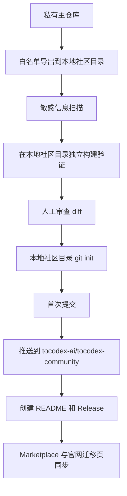

# ToCodex Community 开源版分离方案

日期：2026-05-27

## 1. 目标结论

ToCodex Community 应从当前私有商业主仓库中**物理分离**，先导出到本地独立目录，再发布到独立公开仓库：

```text
本地社区版目录：G:\src\AI_IDE\for_vs_code\ToCodex-Community
公开仓库：https://github.com/tocodex-ai/tocodex-community
```

当前私有仓库继续作为商业主线，保留 Desktop、IDE、Cloud、Admin、运维、商业发布、内部文档和私有配置。`G:\src\AI_IDE\for_vs_code\ToCodex-Community` 作为社区开源版的本地独立工作区，不与私有主仓库共享 `.git` 历史。

推荐模式是：

```text
私有主仓库 g:/src/AI_IDE/for_vs_code/ToCodex/Code
  ├─ 继续开发完整商业版
  ├─ 保留 Desktop / IDE / Admin / Cloud / 内部文档
  └─ 通过白名单导出脚本生成社区版源码快照

本地社区版目录 G:\src\AI_IDE\for_vs_code\ToCodex-Community
  ├─ 只包含可公开的 VS Code 插件、Webview UI、基础 packages
  ├─ 作为独立工作区运行 install / build / test / vsix
  └─ 人工审查通过后推送到 github.com/tocodex-ai/tocodex-community

公开社区仓库 github.com/tocodex-ai/tocodex-community
  ├─ 从本地社区版目录首次提交
  ├─ 使用干净初始提交，不携带私有仓库历史
  └─ 后续通过导出脚本从私有主仓库同步社区版变更
```

## 2. 核心原则

1. **公开仓库不带私有历史**
   - 不使用当前私有仓库直接改 public。
   - 不保留含 token、内部域名、运维备忘录、商业策略、服务端代码的历史 commit。
   - 首次开源用干净目录重新 `git init`。

2. **白名单导出，不做黑名单删除**
   - 不从完整仓库复制后再删敏感目录。
   - 只复制明确允许公开的目录和文件。
   - 防止 `tocodex-admin/`、`ssh/`、`.tocodex/`、内部 docs、patch、dump、临时输出等误入公开仓库。

3. **社区版必须可独立构建**
   - `pnpm install` 可完成依赖安装。
   - `pnpm build` / `pnpm vsix` 可生成 VS Code 插件。
   - CLI 若第一阶段保留，需可独立 `pnpm --filter @roo-code/cli build`。

4. **商业能力不在社区版暴露实现细节**
   - Desktop、IDE、Admin、Cloud 服务端、企业能力全部闭源。
   - 社区版 README 可提及商业增强版存在，但不包含其代码、部署配置或内部接口。

5. **保留 Apache-2.0 上游归属**
   - 明确 ToCodex Community 基于 Roo Code。
   - 保留 Apache-2.0 License / NOTICE / attribution。
   - 避免使用“官方继任者”“RooCode 已改名”等表达。

## 3. 第一阶段建议公开范围

### 3.1 必须保留

| 路径 | 策略 | 说明 |
| --- | --- | --- |
| `src/` | 保留但需清理 | VS Code 插件核心；需要处理 Cloud/Telemetry/私有接口依赖 |
| `webview-ui/` | 保留但需清理 | 插件 UI；需要清理商业入口、Cloud 入口、私有文案 |
| `packages/types/` | 保留 | 公共类型依赖 |
| `packages/core/` | 保留 | CLI 依赖的跨平台核心能力 |
| `packages/build/` | 保留 | 插件构建工具依赖 |
| `packages/config-eslint/` | 保留 | 工作区 lint 配置 |
| `packages/config-typescript/` | 保留 | 工作区 TS 配置 |
| `packages/ipc/` | 倾向保留 | 插件包依赖，需确认是否包含远程/商业能力 |
| `packages/telemetry/` | 保留但默认禁用或替换 | 当前 `src/` 依赖 `@roo-code/telemetry`，社区版应默认 no-op 或明确 opt-in |
| `packages/cloud/` | 第一阶段建议替换/最小化 | 当前 `src/` 依赖 `@roo-code/cloud`，但 Cloud 属闭源商业能力；需要做开源 stub 或移除 Cloud 登录入口 |
| `apps/cli/` | 第二优先级保留 | 备忘录建议 CLI 开源，但当前仍有 Roo Cloud URL 和 Roo 命名，需要清理后再公开 |
| `locales/` | 保留 | 本地化文档，需检查品牌与链接 |
| `icons/` | 保留 | 插件图标；确认版权来源 |
| 根构建配置 | 保留 | `package.json`、`pnpm-workspace.yaml`、`pnpm-lock.yaml`、`turbo.json`、`tsconfig.json`、`.nvmrc`、`.prettierrc.json` 等 |
| 基础社区文档 | 重写后保留 | `README.md`、`CONTRIBUTING.md`、`CODE_OF_CONDUCT.md`、`SECURITY.md`、`PRIVACY.md`、`CHANGELOG.md` |
| `.github/` | 精简后保留 | 仅保留公开 CI、Issue 模板、PR 模板、安全策略 |

### 3.2 必须排除

| 路径/模式 | 原因 |
| --- | --- |
| `apps/desktop/` | Desktop 为闭源商业产品 |
| `tocodex-admin/` | Admin、网关、运营后台、可能含内部 token/配置 |
| `ssh/` | 远程服务器管理相关，不应公开 |
| `.tocodex/` | 含本地规则、计划、进度、MCP 配置，属于内部 AI 工作区状态 |
| `.kiro/` | 内部工作流/配置，先排除 |
| `.vscode/` | 本地开发配置可能泄露路径或内部环境，第一阶段排除或重写 |
| `tocodex-docs/` | 内部备忘录、运维和商业决策，不公开 |
| `tocodex-img/` | 内部架构图，需人工筛选后再决定 |
| `docs/` | 大部分为内部运维/安全/后端方案，第一阶段不整体公开；只挑选重写后的用户文档 |
| `mcp-servers/ssh-server/` | SSH Server MCP 涉及服务器管理能力，第一阶段排除 |
| `icos-pack/` | 打包素材/许可证需确认，第一阶段排除 |
| `new-api-fixes.patch`、`patch*.diff` | 内部补丁和二开痕迹，排除 |
| `_*.txt`、`*_out.txt`、`progress.txt` | 临时输出/日志，排除 |
| `build-release.bat` | 商业多端发布脚本，排除 |
| `build-vsix.bat` | 可重写成社区版 build 脚本后再保留 |

## 4. 需要重点清理的依赖点

当前初步扫描显示：

1. `src/package.json` 依赖：
   - `@roo-code/cloud`
   - `@roo-code/telemetry`
   - `@roo-code/ipc`
   - `@roo-code/core`
   - `@roo-code/types`

2. `src/` 中存在：
   - `import { CloudService, WebAuthService } from "@roo-code/cloud"`
   - `import { TelemetryService } from "@roo-code/telemetry"`
   - `tocodex.com` / `doc.tocodex.com` 链接
   - `TOCODEX_DESKTOP_SHELL` 环境守卫

3. `webview-ui/` 中存在：
   - Cloud 相关组件和测试
   - `doc.tocodex.com` 文档链接
   - 部分 provider 的外部链接仍带 `roocode` campaign 参数

4. `apps/cli/` 中存在：
   - 包名仍为 `@roo-code/cli`
   - bin 命令仍为 `roo`
   - dev 脚本里存在 `app.roocode.com`、`cloud-api.roocode.com`、`api.roocode.com/proxy`

社区版第一阶段有两个可选策略：

### 策略 A：先开源 VS Code 插件，不含 CLI

优点：
- 风险最低。
- 分离范围更小。
- 更快发布 `tocodex-ai/tocodex-community`。

缺点：
- 与备忘录“插件 + CLI 开源”目标不完全一致。
- CLI 需要第二阶段补上。

适用：首发社区版建议采用。

### 策略 B：插件 + CLI 同步开源

优点：
- 与 Open Core 备忘录一致。
- 对 RooCode 用户迁移更完整。

缺点：
- CLI 当前 Roo 命名和 Cloud URL 较多。
- 需要更多清理和验证。

适用：首发前有足够时间完整清理时采用。

## 5. 推荐首发方案

推荐采用 **策略 A+**：

```text
第一阶段公开：VS Code 插件 + Webview UI + 基础 packages
第一阶段不公开：Desktop / Admin / SSH MCP / 内部 docs / CLI
第二阶段公开：清理后的 CLI
```

第一阶段社区仓库结构建议：

```text
tocodex-community/
├─ src/
├─ webview-ui/
├─ packages/
│  ├─ build/
│  ├─ config-eslint/
│  ├─ config-typescript/
│  ├─ core/
│  ├─ ipc/
│  ├─ telemetry/        # 改成 no-op 或默认禁用
│  ├─ types/
│  └─ cloud/            # 改成社区版 stub，或移除后同步改 src
├─ locales/
├─ icons/
├─ scripts/
├─ .github/
├─ README.md
├─ LICENSE
├─ NOTICE
├─ PRIVACY.md
├─ SECURITY.md
├─ CONTRIBUTING.md
├─ CODE_OF_CONDUCT.md
├─ package.json
├─ pnpm-workspace.yaml
├─ pnpm-lock.yaml
├─ turbo.json
├─ tsconfig.json
├─ .nvmrc
├─ .prettierrc.json
└─ .gitignore
```

## 6. Cloud 与账号能力处理方案

社区版不应强依赖 ToCodex Cloud，否则会被认为是“伪开源”。建议：

1. 保留 BYOK、本地模型、OpenAI-compatible Provider、MCP、自定义模式。
2. 移除或隐藏 Cloud 登录入口。
3. 若源码中必须保留 `@roo-code/cloud` 依赖，则社区版 `packages/cloud` 改为 stub：
   - `CloudService` 返回 disabled 状态。
   - `WebAuthService` 不触发 OAuth。
   - API base URL 不含私有 endpoint。
4. README 明确：
   - Community 可完全离线/BYOK 使用。
   - ToCodex Cloud 是可选商业服务，不是运行社区版的必要条件。

## 7. Telemetry 处理方案

社区版 telemetry 默认应禁用：

1. `@roo-code/telemetry` 可保留接口，但默认 no-op。
2. 若保留遥测，必须：
   - README 说明收集内容。
   - 设置页可关闭。
   - Privacy Policy 明确。
3. 首发建议：默认 no-op，后续再考虑社区透明遥测。

## 8. 导出流程设计

后续 Code 模式实施时，建议新增一个导出脚本，但现在先不动代码。

脚本目标：

```text
scripts/export-community.ps1 或 scripts/export-community.mjs
```

流程：

1. 确认本地社区版目录：
   ```text
   G:\src\AI_IDE\for_vs_code\ToCodex-Community
   ```
2. 如果目录不存在则创建；如果目录存在，先检查是否为独立 git 仓库，并避免误删用户已有内容。
3. 按白名单从当前私有主仓库复制目录和文件到该独立目录。
4. 自动删除构建产物、日志、缓存。
5. 写入社区版 README / NOTICE / LICENSE。
6. 执行敏感词扫描。
7. 在 `G:\src\AI_IDE\for_vs_code\ToCodex-Community` 中执行依赖安装和构建验证。
8. 人工审查通过后，再在该目录内 `git init` / commit / 添加远端 / 推送。

推荐不要直接脚本推送 GitHub，先人工检查。

## 9. 安全扫描清单

导出后必须扫描：

```text
secret
password
passwd
token
api_key
apikey
bearer
authorization
private key
BEGIN RSA
BEGIN OPENSSH
sk-
ghp_
gho_
ghs_
ghu_
github_pat
xoxb-
AKIA
aliyun
redis://
postgres://
mysql://
ssh
new-api
tocodex-admin
auth-bridge
88.171.
/opt/
C:/Users/
g:/src/
```

也要扫描私有域名和内部路径：

```text
api.tocodex.com
admin.tocodex.com
4000
new-api
openresty
nginx.conf
```

注意：`tocodex.com`、`doc.tocodex.com` 可以保留，但要确保链接是公开页面。

## 10. 发布步骤



## 11. 首次公开仓库建议设置

GitHub 组织：

```text
tocodex-ai
```

公开仓库：

```text
tocodex-community
```

仓库描述：

```text
ToCodex Community — a maintained open-source continuation and evolution based on Roo Code, with VS Code extension support.
```

Topics：

```text
roocode
roo-code
cline
vscode-extension
ai-coding-agent
coding-agent
mcp
openai
anthropic
claude
byok
tocodex
```

## 12. README 首屏建议

```md
# ToCodex Community

ToCodex Community is a maintained open-source continuation and evolution based on Roo Code, after the original upstream Roo Code repository was archived.

- Maintained VS Code extension
- Apache-2.0 upstream attribution preserved
- BYOK and local models supported
- OpenAI-compatible providers, MCP and custom modes
- Optional ToCodex Desktop / Cloud / Enterprise offerings

Website: https://tocodex.com  
Source: https://github.com/tocodex-ai/tocodex-community

ToCodex is not affiliated with Roo Code, Inc. Roo Code is a trademark of its respective owner.
```

## 13. 后续实施 TODO

1. 确认第一阶段是否只开源 VS Code 插件，不含 CLI。
2. 梳理 `src/` 中 Cloud / Telemetry 的最小 stub 改造点。
3. 梳理 `webview-ui/` 中 Cloud 入口隐藏或替换点。
4. 编写白名单导出脚本。
5. 编写社区版 README / NOTICE / LICENSE / PRIVACY。
6. 执行导出目录敏感扫描。
7. 执行社区版独立构建验证。
8. 初始化公开仓库并推送首个干净提交。

## 14. 推荐决策

当前最稳妥决策：

```text
首发 ToCodex Community 只公开 VS Code 插件版。
本地独立目录固定为 G:\src\AI_IDE\for_vs_code\ToCodex-Community。
CLI 暂不随首发公开，等 Roo 命名、Cloud URL 和运行链路清理完成后作为第二阶段加入。
```

这样能最快形成公开信任，同时最大限度降低泄露私有代码、内部服务和商业逻辑的风险。
